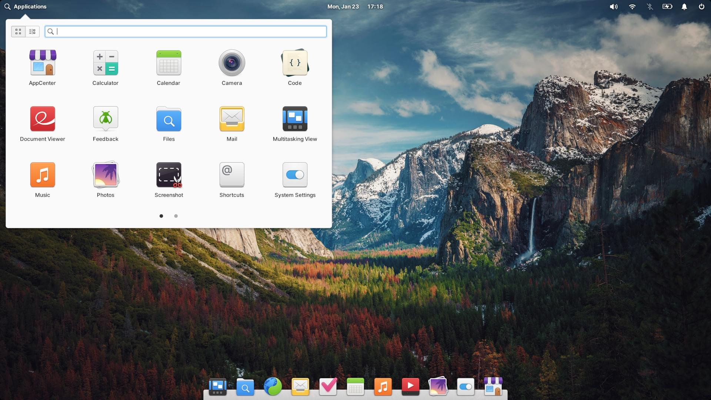
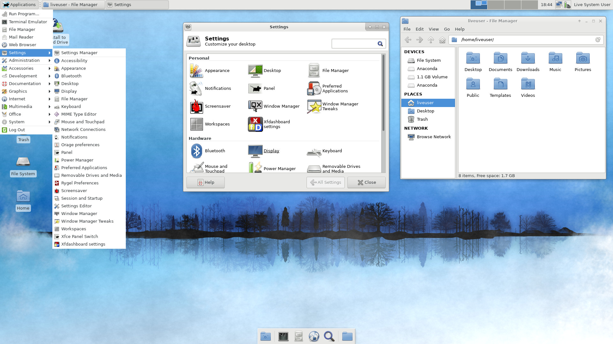
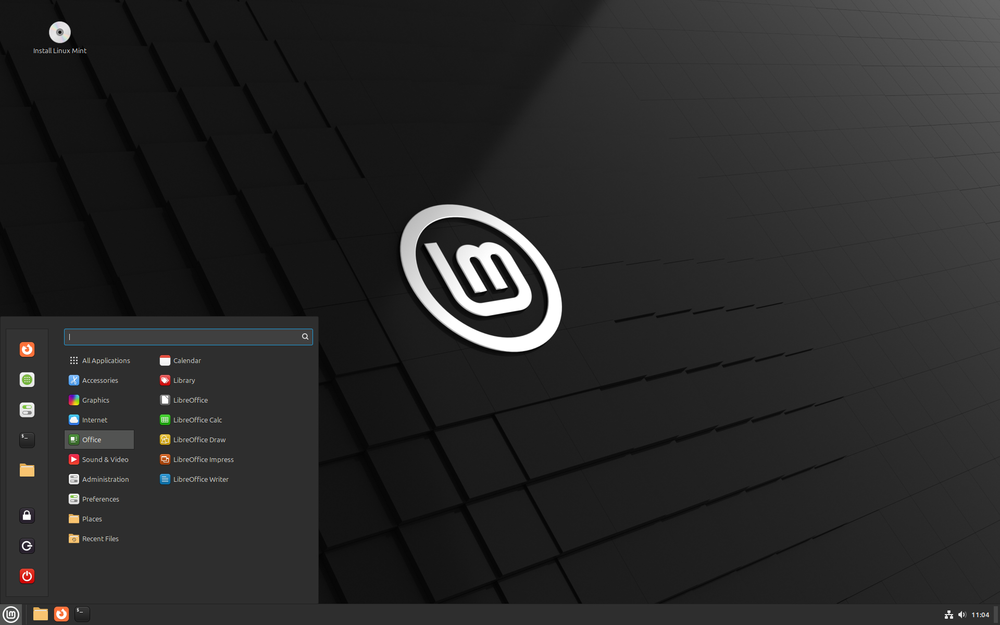
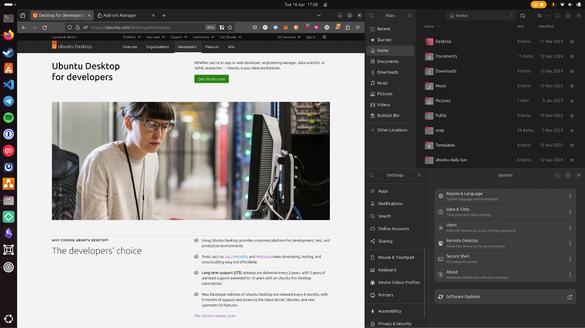

<h1 align="center">Awesome Linux</h1>

We all know that Linux is awesome, but here's a list of especially awesome things related to the Linux ecosystem.

## Table of Content

> Sorted alphabetically.

* [Distributions](#distributions)
  * [Beginners](#beginners)
    * [elementary OS](#elementary-os)
    * [Fedora](#fedora)
    * [Linux Mint](#linux-mint)
    * [Ubuntu](#ubuntu)
  * [Intermediate](#intermediate)
    * [CentOS](#centos)
    * [Debian GNU/Linux](#debian-gnulinux)
    * [Mageia](#mageia)
    * [Manjaro](#manjaro)
    * [openSUSE](#opensuse)
  * [Advanced](#advanced)
    * [Arch Linux](#arch-linux)
  * [Special Purpose](#special-purpose)
    * [CoreOS](#coreos)
    * [Kali Linux](#kali-linux)
    * [Puppy Linux](#puppy-linux)
    * [Ubuntu Studio](#ubuntu-studio)
    * [Tails](#tails)
* [Learning Resources](#learning-resources)
  * [Books](#books)
  * [Courses](#courses)
* [X Desktop Environments](#x-desktop-environments)
  * [GNOME](#gnome)
  * [KDE](#kde)
  * [Xfce](#xfce)
  * [LXDE](#lxde)
  * [Other Desktop Environments](#other-desktop-environments)
* [X Windows Managers](#x-windows-managers)
* [Applications](#applications)
  * [GUI-based Applications](#gui-based-applications)
    * [GNOME-based](#gnome-based)
    * [Pantheon-based](#pantheon-based)
    * [KDE-based](#kde-based)
    * [Not based on any desktop environment](#not-based-on-any-desktop-environment)
    * [Third-party clients for online services](#third-party-clients-for-online-services)
    * [Package management and creation tools](#distro-based-package-management-tools)
  * [Console-based Applications and Tools](#console-based-applications-and-tools)
* [Useful Websites](#useful-websites)
* [License](#license)

## Distributions

Distributions are organized into three different categories: for **beginners**, for **intermediate** users and for **advanced** users. In those categories, the distributions are organized in the alphabetical order.

### Beginners

#### [elementary OS](https://elementary.io/)

> elementary OS is an Ubuntu-based desktop distribution. Some of its more interesting features include a custom desktop environment called Pantheon and many custom apps including Photos, Music, Videos, Calendar, Terminal, Files, and more. It also comes with some familiar apps like the Epiphany web browser and a fork of Geary mail.

* **Latest version:** elementary OS 7.1 Horus
* **Default Desktop Environment:** Pantheon

#### [Fedora](https://getfedora.org/)

> Fedora (formerly Fedora Core) is a Linux distribution developed by the community-supported Fedora Project and owned by Red Hat. Fedora contains software distributed under a free and open-source license and aims to be on the leading edge of such technologies. Fedora has a reputation for focusing on innovation, integrating new technologies early on and working closely with upstream Linux communities. The default desktop in Fedora is the GNOME desktop environment and the default interface is the GNOME Shell. Other desktop environments, including KDE, Xfce, LXDE, MATE and Cinnamon, are available. Fedora Project also distributes custom variations of Fedora called Fedora spins. These are built with specific sets of software packages, offering alternative desktop environments or targeting specific interests such as gaming, security, design, scientific computing and robotics.

* **Latest version:** Fedora 39
* **Default Desktop Environment:** GNOME

#### [Linux Mint](https://linuxmint.com/)

> Linux Mint is an Ubuntu-based distribution whose goal is to provide a more complete out-of-the-box experience by including browser plugins, support for DVD playback, Java and other components. It also adds a custom desktop and menus, several unique configuration tools, and a web-based package installation interface. Linux Mint is compatible with Ubuntu software repositories.

* **Latest version:** Linux Mint 21.3 "Virginia"
* **Default Desktop Environment:** Cinnamon and MATE

#### [Ubuntu](https://www.ubuntu.com/)

> Ubuntu is a complete desktop Linux operating system, freely available with both community and professional support. The Ubuntu community is built on the ideas enshrined in the Ubuntu Manifesto: that software should be available free of charge, that software tools should be usable by people in their local language and despite any disabilities, and that people should have the freedom to customise and alter their software in whatever way they see fit. "Ubuntu" is an ancient African word, meaning "humanity to others". The Ubuntu distribution brings the spirit of Ubuntu to the software world.

* **Latest version:** Ubuntu 24.04 LTS (Noble Numbat)
* **Default Desktop Environment:** GNOME

### Intermediate

#### [CentOS](https://www.centos.org/)

> CentOS as a group is a community of open source contributors and users. Typical CentOS users are organisations and individuals that do not need strong commercial support in order to achieve successful operation. CentOS is 100% compatible rebuild of the Red Hat Enterprise Linux, in full compliance with Red Hat's redistribution requirements. CentOS is for people who need an enterprise class operating system stability without the cost of certification and support.

* **Latest version:** CentOS Stream 9
* **Default Desktop Environment:** GNOME

#### [Debian GNU/Linux](https://www.debian.org/)

> The Debian Project is an association of individuals who have made common cause to create a free operating system. This operating system is called Debian. Debian systems currently use the Linux kernel. Linux is a completely free piece of software started by Linus Torvalds and supported by thousands of programmers worldwide. Of course, the thing that people want is application software: programs to help them get what they want to do done, from editing documents to running a business to playing games to writing more software. Debian comes with over 50,000 packages (precompiled software that is bundled up in a nice format for easy installation on your machine) - all of it free. It's a bit like a tower. At the base is the kernel. On top of that are all the basic tools. Next is all the software that you run on the computer. At the top of the tower is Debian -- carefully organizing and fitting everything so it all works together.

* **Latest version:** Debian 12 (Bookworm)
* **Default Desktop Environment:** GNOME

#### [Mageia](https://www.mageia.org/)

> Mageia is a fork of Mandriva Linux formed in September 2010 by former employees and contributors to the popular French Linux distribution. Unlike Mandriva, which is a commercial entity, the Mageia project is a community project and a non-profit organisation whose goal is to develop a free Linux-based operating system.

* **Latest version:** Mageia 9
* **Default Desktop Environment:** KDE Plasma

#### [Manjaro](https://manjaro.org/)

> Manjaro Linux is a fast, user-friendly, desktop-oriented operating system based on Arch Linux. Key features include intuitive installation process, automatic hardware detection, stable rolling-release model, ability to install multiple kernels, special Bash scripts for managing graphics drivers and extensive desktop configurability. Manjaro Linux offers Xfce as the core desktop options, as well as a minimalist Net edition for more advanced users. Community-supported GNOME 3/Cinnamon and KDE flavours are available. Users also benefit from the supportive and vibrant Manjaro community forum.

* **Latest version:** Manjaro 23.1.3
* **Default Desktop Environment:** XFCE, KDE Plasma, GNOME

#### [openSUSE](https://www.opensuse.org/)

> The openSUSE project is a community program sponsored by SUSE Linux and other companies. Promoting the use of Linux everywhere, this program provides free, easy access to openSUSE, a complete Linux distribution. The openSUSE project has three main goals: make openSUSE the easiest Linux for anyone to obtain and the most widely used Linux distribution; leverage open source collaboration to make openSUSE the world's most usable Linux distribution and desktop environment for new and experienced Linux users; dramatically simplify and open the development and packaging processes to make openSUSE the platform of choice for Linux developers and software vendors.

* **Latest version:** openSUSE Leap 15.5 and openSUSE Tumbleweed (Rolling Release system)
* **Default Desktop Environment:** KDE Plasma, GNOME, XFCE (Choose on installation)

### Advanced

#### [Arch Linux](https://www.archlinux.org/)

> Arch Linux is an independently developed, x86_64-optimised Linux distribution targeted at competent Linux users. It uses 'pacman', its home-grown package manager, to provide updates to the latest software applications with full dependency tracking. Operating on a rolling release system, Arch can be installed from a CD image or via an FTP server. The default install provides a solid base that enables users to create a custom installation. In addition, the Arch Build System (ABS) provides a way to easily build new packages, modify the configuration of stock packages, and share these packages with other users via the Arch Linux user repository.

* **Latest version:** Not applicable (Rolling Release system)
* **Default Desktop Environment:** Not applicable (there's no default Desktop environment)

### Special Purpose

#### [CoreOS](https://coreos.com/)

* **Specialty:** Clusters

> CoreOS is now part of Red Hat and has evolved into Fedora CoreOS, which is a lightweight, container-focused operating system that is designed for running containerized workloads securely and at scale.

#### [Kali Linux](https://www.kali.org/)

* **Specialty:** Penetration testing

> Kali Linux (formerly known as BackTrack) is a Debian-based distribution with a collection of security and forensics tools. It features timely security updates, support for the ARM architecture, a choice of four popular desktop environments, and seamless upgrades to newer versions.

* **Latest version:** Kali Linux 2024.1

#### [Ubuntu Studio](https://ubuntustudio.org/)

* **Specialty:** Multimedia creation

> Ubuntu Studio is a variant of Ubuntu aimed at the GNU/Linux audio, video and graphic enthusiast as well as professional. The distribution provides a collection of open-source applications available for multimedia creation.

* **Latest version:** Ubuntu Studio 24.04 LTS

#### [Tails](https://tails.boum.org/index.en.html)

* **Specialty:** Incognito live system

> Tails is a live system that aims to preserve your privacy and anonymity. It helps you to use the Internet anonymously and circumvent censorship almost anywhere you go and on any computer but leaving no trace unless you ask it to explicitly. It is a complete operating system designed to be used from a USB stick or a DVD independently of the computer's original operating system. It is Free Software and based on Debian GNU/Linux. Tails comes with several built-in applications pre-configured with security in mind: web browser, instant messaging client, email client, office suite, image and sound editor, etc.

* **Latest version:** Tails 6.0

#### [Pop!_OS](https://pop.system76.com/)

* **Specialty:** Development and Creative Work

> Pop!_OS is a Linux distribution developed by System76, a computer manufacturer specializing in Linux-based systems. It's built on top of Ubuntu and features a customized GNOME desktop environment called COSMIC. The distribution is optimized for creative professionals, developers, and STEM users, with built-in support for both AMD and NVIDIA GPUs, excellent power management, and automatic window tiling. Pop!_OS also includes a custom application store and features like disk encryption by default.

* **Latest version:** Pop!_OS 22.04 LTS
* **Default Desktop Environment:** COSMIC (based on GNOME)

#### [Zorin OS](https://zorin.com/os/)

* **Specialty:** Windows-like Experience

> Zorin OS is a Ubuntu-based Linux distribution designed specifically for newcomers to Linux. It features a Windows-like graphical interface and includes Wine, enabling users to run many Windows applications. The distribution aims to make Linux easy to use for people accustomed to Windows and macOS, while also providing powerful features for advanced users.

* **Latest version:** Zorin OS 17
* **Default Desktop Environment:** Zorin Desktop (based on GNOME)

#### [EndeavourOS](https://endeavouros.com/)

* **Specialty:** User-Friendly Arch Linux

> EndeavourOS is the spiritual successor to Antergos, aimed at making Arch Linux more accessible to newcomers while still maintaining the DIY (do it yourself) spirit of Arch. It provides a friendly graphical installer and a welcoming community, while keeping the system as close to pure Arch as possible. The distribution comes with a choice of desktop environments and minimal bloat.

* **Latest version:** EndeavourOS Cassini (Rolling Release)
* **Default Desktop Environment:** XFCE (multiple options available during installation)

#### [Linux From Scratch (LFS)](https://www.linuxfromscratch.org/)

* **Specialty:** Educational

> Linux From Scratch (LFS) is not a traditional distribution, but rather a book and project that provides step-by-step instructions for building your own custom Linux system from source code. It's an excellent educational resource for understanding how Linux systems work at a fundamental level. The project also includes Beyond Linux From Scratch (BLFS), which adds additional functionality to the base LFS system.

* **Latest version:** LFS 12.1
* **Default Desktop Environment:** Not applicable (build your own)

#### [Garuda Linux](https://garudalinux.org/)

* **Specialty:** Gaming and Performance

> Garuda Linux is an Arch-based Linux distribution focused on performance and gaming. It features the Zen kernel by default, BTRFS filesystem with automatic snapshots, and a variety of desktop environment choices. The distribution comes with many gaming-oriented tools and optimizations pre-configured, making it an excellent choice for Linux gamers.

* **Latest version:** Rolling Release
* **Default Desktop Environment:** KDE Plasma (Dr460nized)

## Learning Resources

### Books

#### [The Linux Command Line](https://www.goodreads.com/book/show/11724436-the-linux-command-line) [4.36] [[FREE](https://linuxcommand.org/tlcl.php)]

This is a great introduction to the Linux command line. - [@4iar](https://github.com/4iar/)

> You've experienced the shiny, point-and-click surface of your Linux computer—now dive below and explore its depths with the power of the command line.

#### [The Debian Administrator's Handbook, Debian Wheezy from Discovery to Mastery](https://www.goodreads.com/book/show/20839133-the-debian-administrator-s-handbook-debian-wheezy-from-discovery-to-mas) [4.83] [[FREE](https://debian-handbook.info/get/now/)]

Good book that teaches you the basics of Debian GNU/Linux administration. - [@elninosi](https://github.com/elninosi)

> It covers all the topics that a competent Linux administrator should master, from the installation, update of the system, up to the creation of packages and the compilation of the kernel, but also monitoring, backup and migration. Plus advanced topics to secure services, automated installations, or virtualization.

#### Bash Shell Scripting [[FREE](https://en.wikibooks.org/wiki/Bash_Shell_Scripting)]

> Currently this book provides an introduction level knowledge of Bash.

### Courses

#### [Introduction to Linux (LFS101x-1)](https://www.edx.org/course/introduction-linux-linuxfoundationx-lfs101x-1) [Free]

Organized by the Linux Foundation, it's a great free course to learn basics about Linux. - [@aleksandar-todorovic](https://github.com/aleksandar-todorovic)

If you used Windows and decided to switch to Linux, this course should help you to find their alternatives. It's pretty short and you can finish it in a day. - [@aleksandar-todorovic](https://github.com/aleksandar-todorovic)

#### [Practice Linux Commands](https://labex.io/courses/linux-basic-commands-practice-online) [Free]

> This course is designed for beginners who want to learn Linux commands. It is a hands-on course with practice exercises that will help you to be familiar with the Linux command line.

### Bash Learning Resources

* [Quick Start with Shell](https://labex.io/courses/quick-start-with-shell)
* [Beautiful Bash: Let's make reading and writing bash scripts fun again!](https://www.slideshare.net/a_z_e_t/inpresentation)
* [Shell Style Guide](https://google.github.io/styleguide/shell.xml)
* [Linux Fu: Better Bash Scripting](https://hackaday.com/2017/07/21/linux-fu-better-bash-scripting/)
* [Bash Guide for Beginners](https://linux.die.net/Bash-Beginners-Guide/)
* [Advanced Bash-Scripting Guide](https://linux.die.net/abs-guide/)

## X Desktop Environments

> You cannot talk about a unified Linux look because there is no such thing.

#### [GNOME](https://www.gnome.org)

> GNOME provides a modern desktop environment that emphasizes simplicity and user experience. Now in its GNOME 45 release, it offers a polished and cohesive computing experience with excellent touch support, gesture controls, and a clean, minimalist interface. GNOME is developed by the GNOME community, a diverse, international group of contributors that is supported by an independent, non-profit foundation. The environment features a modern activities overview, integrated search, extensions support, and excellent integration with online services.

* **Latest version:** GNOME 45
* **Key Features:**
  * Modern Activities Overview
  * Universal Search
  * Dynamic Workspaces
  * Extensions Support
  * Touch and Gesture Support
  * GTK4 and libadwaita Design Language

#### [KDE Plasma](https://www.kde.org)

> The KDE® Community creates Plasma, a powerful and highly customizable desktop environment that provides an elegant and modern computing experience. Plasma combines traditional desktop metaphors with modern technologies like Wayland support, adaptive transparency, and hardware acceleration. It offers extensive customization options while maintaining performance and stability. The environment includes a comprehensive suite of applications and development tools, making it suitable for both casual users and professionals.

* **Latest version:** Plasma 6
* **Key Features:**
  * Highly Customizable Interface
  * Wayland Support
  * KRunner Universal Search
  * Activities and Virtual Desktops
  * Widget System
  * Qt-based Framework

#### [Xfce](https://www.xfce.org/)

> Xfce is a lightweight desktop environment for UNIX-like operating systems. It aims to be fast and low on system resources, while still being visually appealing and user friendly. The project has evolved significantly while maintaining its core principles of speed and efficiency. Modern Xfce includes improvements in theming, better support for high DPI displays, and enhanced compatibility with modern technologies while keeping its traditional desktop layout.

* **Latest version:** Xfce 4.18
* **Key Features:**
  * Lightweight and Fast
  * Traditional Desktop Layout
  * Modular Design
  * Low Resource Usage
  * High DPI Support
  * GTK3 Based

#### [MATE](https://www.mate-desktop.org/)

> MATE Desktop Environment is the continuation of GNOME 2. It provides an intuitive and attractive desktop environment using traditional metaphors for Linux and other Unix-like operating systems. MATE has evolved to support modern technologies while maintaining the classic desktop experience that many users prefer. The project actively maintains and improves the codebase, adding support for new technologies while preserving the familiar workflow.

* **Latest version:** MATE 1.27
* **Key Features:**
  * Traditional Desktop Experience
  * Modern GTK3 Support
  * Comprehensive Application Suite
  * HiDPI Support
  * System Monitor
  * Window Management

#### [Cinnamon](https://projects.linuxmint.com/cinnamon/)

> Cinnamon is a desktop environment that offers a modern take on the traditional desktop metaphor. Originally forked from GNOME Shell, it has evolved into its own distinct project. Cinnamon provides advanced features and customization options while maintaining a familiar and intuitive user experience. It's the flagship desktop environment of Linux Mint and has gained popularity for its balance of functionality and ease of use.

* **Latest version:** Cinnamon 6.0
* **Key Features:**
  * Traditional Desktop Layout
  * Advanced Effects
  * Applets System
  * Custom Themes Support
  * Nemo File Manager
  * Extensive Settings Manager

#### Modern Alternatives

* [Budgie](https://buddiesofbudgie.org/) - A modern desktop environment focusing on simplicity and elegance, originally developed by Solus and now maintained by Buddies of Budgie.
* [Cosmic](https://github.com/pop-os/cosmic) - System76's new desktop environment written in Rust, featuring a modern design and focus on productivity.
* [Hyprland](https://hyprland.org/) - A dynamic tiling Wayland compositor offering a modern take on desktop interaction with animations and effects.
* [Pantheon](https://elementary.io) - The desktop environment of elementary OS, known for its macOS-like interface and focus on design consistency.
* [Cutefish](https://cutefish-ubuntu.github.io/) - A new desktop environment with a focus on simplicity, beauty and practicality.

### Notable Mentions

* **Window Managers**: Many users opt for standalone window managers instead of full desktop environments:
  * **i3wm**: Popular tiling window manager
  * **Sway**: Wayland compositor implementing i3 compatible window management
  * **AwesomeWM**: Highly configurable window manager
  * **BSPWM**: Binary space partitioning window manager

* **Compositors**:
  * **Picom**: Modern X11 compositor
  * **Wayfire**: 3D Wayland compositor
  * **Mutter**: GNOME's Wayland compositor
  * **KWin**: KDE Plasma's window manager and compositor

### Rising Desktop Environments

#### [Deepin Desktop Environment (DDE)](https://www.deepin.org/en/dde/)

> Deepin Desktop Environment is a beautiful, easy-to-use desktop environment originally created for deepin Linux. It features a modern design language, smooth animations, and integrated tools. DDE is built with Qt and offers a unique blend of aesthetics and functionality.

* **Latest version:** DDE 23
* **Key Features:**
  * Modern Design Language
  * Custom Widget Toolkit
  * Control Center
  * Dock and Launcher
  * Screen Split
  * Cloud Sync

#### [Enlightenment](https://www.enlightenment.org/)

> Enlightenment is not just a window manager for Linux/X11 and others, but also a whole suite of libraries to help create beautiful user interfaces with much less work. It's highly customizable and has been in development since 1996, evolving significantly over time.

* **Latest version:** E27
* **Key Features:**
  * Compositing Manager
  * Module System
  * Low Resource Usage
  * Advanced Theming
  * Wayland Support

#### [ukui](https://www.ukui.org/)

> UKUI (Ubuntu Kylin User Interface) is a desktop environment developed by Ubuntu Kylin team. It's designed to be efficient, beautiful, and easy to use, with particular attention to traditional Chinese aesthetics and usability patterns.

* **Latest version:** UKUI 3.1
* **Key Features:**
  * Traditional Design Elements
  * Global Search
  * Panel Customization
  * Window Effects
  * Qt5 Based

### Experimental & Research Projects

* [Project Looking Glass](https://en.wikipedia.org/wiki/Project_Looking_Glass) - A 3D desktop environment research project
* [Lumina](https://lumina-desktop.org/) - A lightweight desktop environment designed for FreeBSD
* [Hawaii Desktop](https://github.com/hawaii-desktop) - A Qt-based desktop environment designed for Wayland

### Desktop Environment Technologies

* **Modern Display Servers:**
  * **Wayland** - The modern display server protocol replacing X11
  * **Arcan** - A display server, multimedia framework and game engine
  
* **GUI Toolkits:**
  * **GTK4** - The latest version of the GIMP Toolkit
  * **Qt6** - Modern version of the Qt framework
  * **libadwaita** - GNOME's new design library
  * **EFL** - Enlightenment Foundation Libraries

* **Session Management:**
  * **systemd-logind** - Modern login and seat management
  * **elogind** - The systemd-logind daemon part
  * **ConsoleKit2** - Alternative to logind for non-systemd systems

### Notable Mentions

* **Window Managers**: Many users opt for standalone window managers instead of full desktop environments:
  * **i3wm**: Popular tiling window manager
  * **Sway**: Wayland compositor implementing i3 compatible window management
  * **AwesomeWM**: Highly configurable window manager
  * **BSPWM**: Binary space partitioning window manager

* **Compositors**:
  * **Picom**: Modern X11 compositor
  * **Wayfire**: 3D Wayland compositor
  * **Mutter**: GNOME's Wayland compositor
  * **KWin**: KDE Plasma's window manager and compositor

## X Windows Managers

* [9wm](https://unauthorised.org/dhog/9wm.html) - Window manager that attempts to emulate the Plan 9 window manager 8-1/2 as far as possible within the constraints imposed by X.
* [awesome](https://awesomewm.org/) - Highly configurable window manager for X. Fast and extensible.
* [Blackbox](https://github.com/bradleythughes/blackbox) - Lightweight window manager for the X window system, without library dependencies. Built using C++.
* [bspwm](https://github.com/baskerville/bspwm) - Tiling window manager that represents windows as the leaves of a full binary tree.
* [Compiz](https://launchpad.net/compiz) - OpenGL compositing window manager. It has a plug-in system to be changed at runtime.
* [dwm](https://dwm.suckless.org/) - Dynamic window manager for X. It manages windows in tiled, monocle and floating layouts. All of the layouts can be applied dynamically, optimising the environment for the application and task performed.
* [Enlightenment](https://www.enlightenment.org/) - Window manager bundled with a whole suite of libraries to help you create beautiful user interfaces.
* [FVWM](https://fvwm.org/) - ICCCM-compliant multiple virtual desktop window manager for X. Extremely powerful.
* [i3](https://i3wm.org/) - Tiling window manager. BSD-licensed. Primarily targeted at advanced users and developers.
* [IceWM](https://ice-wm.org/) - Window manager with the goal of being fast, simple, and not getting in the user's way.
* [JWM](https://www.joewing.net/projects/jwm/) - Lightweight window manager for X11. Good choice for older and/or less powerful systems, though perfectly capable of running on modern systems. Built using C.
* [Matchbox](https://www.yoctoproject.org/software-item/matchbox/) - Environment for X running on non-desktop embedded platforms such as handhelds, set-top boxes, kiosks and anything else for which screen space, input mechanisms or system resources are limited.
* [Mutter](https://download.gnome.org/sources/mutter/) - Window manager for X. Default window manager in GNOME 3.
* [ratpoison](https://www.nongnu.org/ratpoison/) - A simple window manager with no library dependencies, no graphics, and no decorations. Modeled after GNU Screen.
* [Sawfish](https://sawfish.tuxfamily.org/) - Extensible window manager. Its aim is to manage windows in the most flexible and attractive manner possible. Built using Lisp-based scripting language.
* [xmonad](https://xmonad.org/) - Dynamically tiling X11 window manager. Makes work easier by automating aligning and searching for windows. Built using Haskell.

## Applications

The list of awesome Linux applications that you should be using.

If you're looking for some pro-tips for your favorite text editor, you might be interested in [awesome-atom](https://github.com/mehcode/awesome-atom), [sublime-bookmarks](https://github.com/dreikanter/sublime-bookmarks), [vim-galore](https://github.com/mhinz/vim-galore), [awesome-emacs](https://github.com/emacs-tw/awesome-emacs), or [awesome-vscode](https://github.com/viatsko/awesome-vscode).

### GUI-based Applications

#### GNOME-based

* [Builder](https://wiki.gnome.org/Apps/Builder) - IDE for GNOME that is focused on bringing the power of the GNOME platform to more developers.
* [Evince](https://wiki.gnome.org/Apps/Evince) - The most popular document viewer on the GNOME platform.
* [Gedit](https://wiki.gnome.org/Apps/Gedit) - Powerful general purpose text editor.
* [Polari](https://wiki.gnome.org/Apps/Polari) - IRC client built to be easy to use.
* [To Do](https://wiki.gnome.org/Apps/Todo) - Minimalistic personal task manager designed to fit right into your GNOME desktop.

#### Pantheon-based

* [Spice-Up](https://github.com/Philip-Scott/Spice-up) - Desktop presentation app.
* [Vocal](https://vocalproject.net/) - Podcast client for the modern desktop.

For more Pantheon-based apps, visit [elementary-apps](https://quassy.github.io/elementary-apps/).

#### KDE-based

* [Dolphin](https://userbase.kde.org/Dolphin) - File manager for KDE focusing on usability.
* [Krita](https://krita.org/en/) - Painting program.

#### Not based on any desktop environment

* [Atom](https://atom.io) - Hackable text editor for the 21st century.
* [GParted](https://gparted.sourceforge.io/) - The most popular disk partitioning software out there.
* [Kodi](https://kodi.tv/) - Most popular entertainment center.
* [Zathura](https://pwmt.org/projects/zathura/) - Highly customizable document viewer. It provides a minimalistic and space saving interface as well as an easy usage that mainly focuses on keyboard interaction.
* [Etcher](https://www.balena.io/etcher/) - Flash OS images to SD cards and USB drives, safely and easily.

#### Package management and creation tools

Distro-oriented:

* [Y PPA Manager](https://launchpad.net/y-ppa-manager) (Ubuntu) - Manage PPAs and search for packages.
* [pirut](https://fedoraproject.org/wiki/Tools/pirut) (Fedora) - Provides a set of graphical tools for managing software.
* [Synaptics](https://www.nongnu.org/synaptic/) (Debian and `.deb` users) - Graphical package management program for `apt`.
* [YaST](https://en.opensuse.org/YaST_Software_Management) (openSUSE) - Main package management tool on openSUSE.
* [dnfdragora](https://github.com/manatools/dnfdragora) (Fedora) - A GUI for the `dnf` package manager.
* [Yay](https://github.com/Jguer/yay) (Arch) - Yay is one of the many wrappers to `pacman` which automatically downloads and installs packages from AUR, a full list can be found [here](https://wiki.archlinux.org/index.php/AUR_helpers).
* [Aura](https://github.com/aurapm/aura) (Arch) - Secure, multilingual package manager.

Distro-independent:

* [AppImageKit](https://github.com/probonopd/AppImageKit) - Using AppImageKit you can package applications in the [AppImage](https://appimage.org/) format that runs on common Linux-based operating systems, such as RHEL, CentOS, Ubuntu, Fedora, debian and derivatives; one app = one file.

### Console-based Applications and Tools

You might also be interested in checking out [awesome-shell](https://github.com/alebcay/awesome-shell), [awesome-bash](https://github.com/awesome-lists/awesome-bash), [awesome-zsh-plugins](https://github.com/unixorn/awesome-zsh-plugins) or [awesome-fish](https://github.com/jbucaran/awesome-fish).

* [cmus](https://cmus.github.io/) - Small, fast and powerful console music player.
* [fuck](https://github.com/nvbn/thefuck) - Command line tool which corrects your previously mistyped command.
* [git](https://git-scm.com/) - Distributed version control system designed to handle everything from small to very large projects with speed and efficiency.
* [glances](https://nicolargo.github.io/glances/) - Cross-platform system monitoring tool.
* [htop](https://hisham.hm/htop/) - Nice looking, customizable task manager.
* [nano](https://www.nano-editor.org) - Simple to use text editor.
* [photorec](https://www.cgsecurity.org/wiki/PhotoRec) - Useful tool for restoring deleted files.
* [ranger](https://github.com/ranger/ranger) - Vim-inspired file manager for the console.
* [screenFetch](https://github.com/KittyKatt/screenFetch) - Fetches system/theme information in terminal.
* [shellcheck](https://github.com/koalaman/shellcheck) - Static analysis tool for shell scripts.
* [speed-test](https://github.com/sindresorhus/speed-test) - Test your Internet connection speed and ping using [speedtest.net](https://www.speedtest.net/).
* [testdisk](https://www.cgsecurity.org/wiki/TestDisk) - A tool for disk partition recovery.
* [tig](https://github.com/jonas/tig) - Text-mode interface for git. It functions mainly as a Git repository browser.
* [vtop](https://github.com/MrRio/vtop) - Easily-extendable activity monitor.
* [wavemon](https://github.com/uoaerg/wavemon) - Monitoring application for wireless network devices.
* [youtube-dl](https://github.com/rg3/youtube-dl) - A tool to download videos from YouTube and other video sites.

## Useful Websites

#### [AlternativeTo](https://alternativeto.net)

 > Find better alternatives to the software you already use or a replacement for software you cannot or do not want to use.

#### [Linux Foundation](https://www.linuxfoundation.org/)

> The Linux Foundation is a non-profit consortium dedicated to fostering the growth of Linux. Founded in 2000, The Linux Foundation sponsors the work of Linux creator Linus Torvalds and is supported by leading Linux and open source companies and developers from around the world.

#### [Linux.com](https://www.linux.com/)

> For the community, by the community, Linux.com strives to be the central source for informed, reasonable, and intelligent Linux information, software, documentation and answers across the server, desktop/netbook, mobile, and embedded areas.

#### [Kernel.org](https://www.kernel.org/)

> The Linux Kernel Organization is a California Public Benefit Corporation established in 2002 to distribute the Linux kernel and other Open Source software to the public without charge.

#### [Opensource.com](https://opensource.com)

> Opensource.com is an online publication focused on how open source is applied to different areas including business, education, government, health, law and other disciplines of life.

> Our goal is to further the open source way by sharing the open source movement. Our community of readers is made up of those who believe that open participation and sharing can tackle the business, social, environmental, and technological challenges facing us today.

#### [Linux.die](https://linux.die.net/)

> Linux.die is a resource with documentation, tutorials, books, etc in Linux.

#### [LabEx](https://labex.io/)

> LabEx is a platform that provides free online courses on Linux, DevOps, and other IT-related topics.
